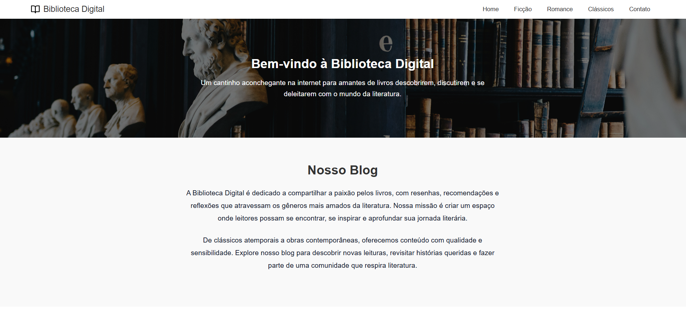

# 📚 Biblioteca Digital

Bem-vindo ao **Biblioteca Digital**, um site simples e elegante feito com HTML e CSS que celebra o amor pelos livros!  
Aqui, você pode explorar diferentes gêneros literários, como **Ficção**, **Romance** e **Clássicos**, além de entrar em contato com a equipe por meio de uma página dedicada.

---

## 📷 Preview

---

## 🧭 Navegação

- **Home** – Introdução com imagem de fundo e texto de boas-vindas
- **Sobre o Blog** – Explicação do objetivo da Biblioteca Digital
- **Conteúdos em Destaque** – Cards interativos com links para páginas específicas
- **Ficção, Romance, Clássicos** – Seções específicas para cada gênero
- **Contato** – Formulário e informações de contato com design moderno

---

## 🧱 Tecnologias Utilizadas

- HTML5 semântico
- CSS3 com variáveis customizadas
- Design moderno
- Estrutura de arquivos organizada

---

